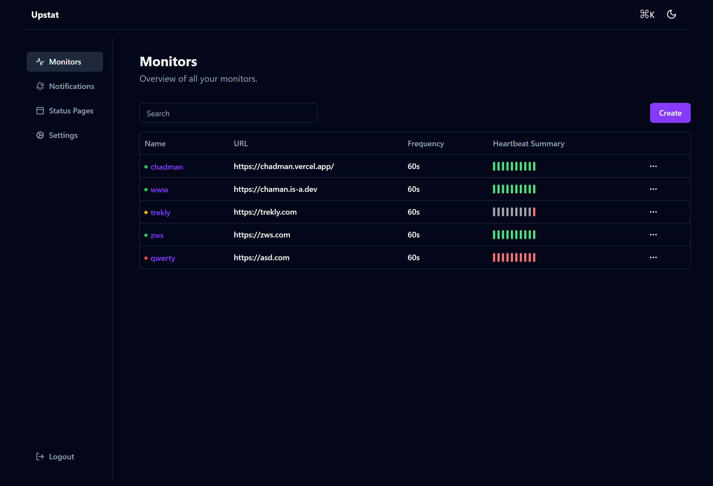
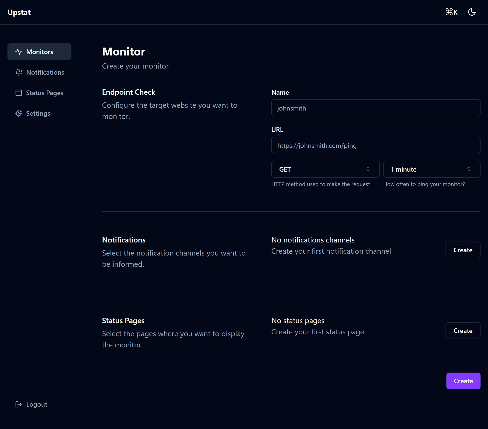
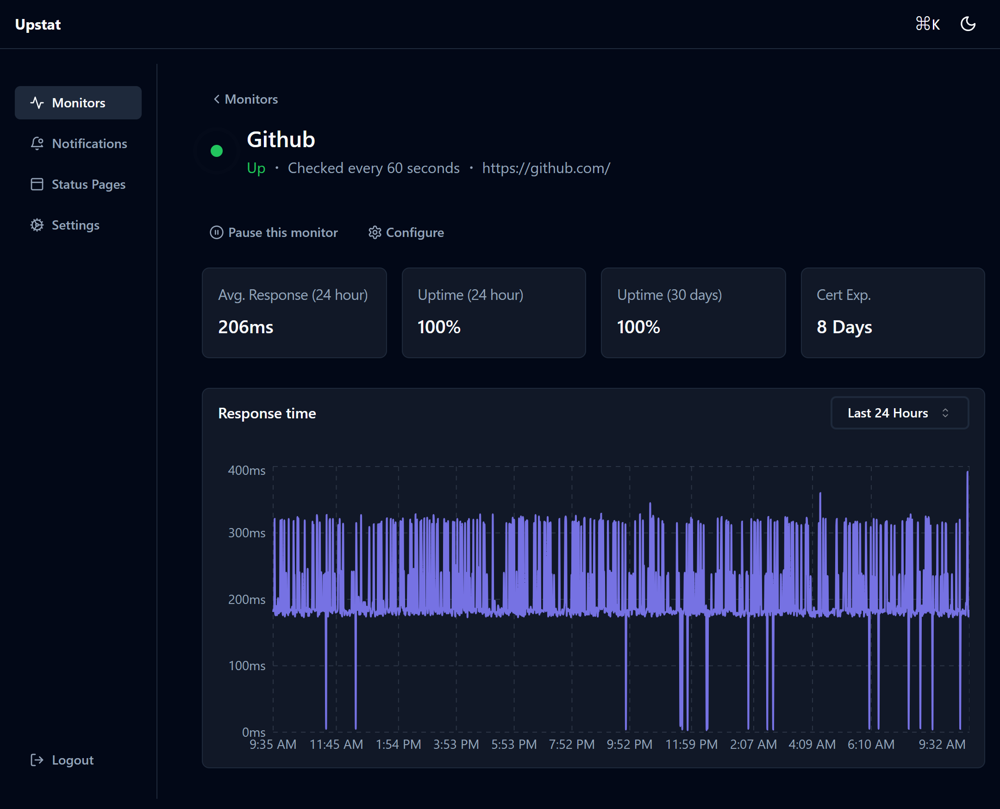
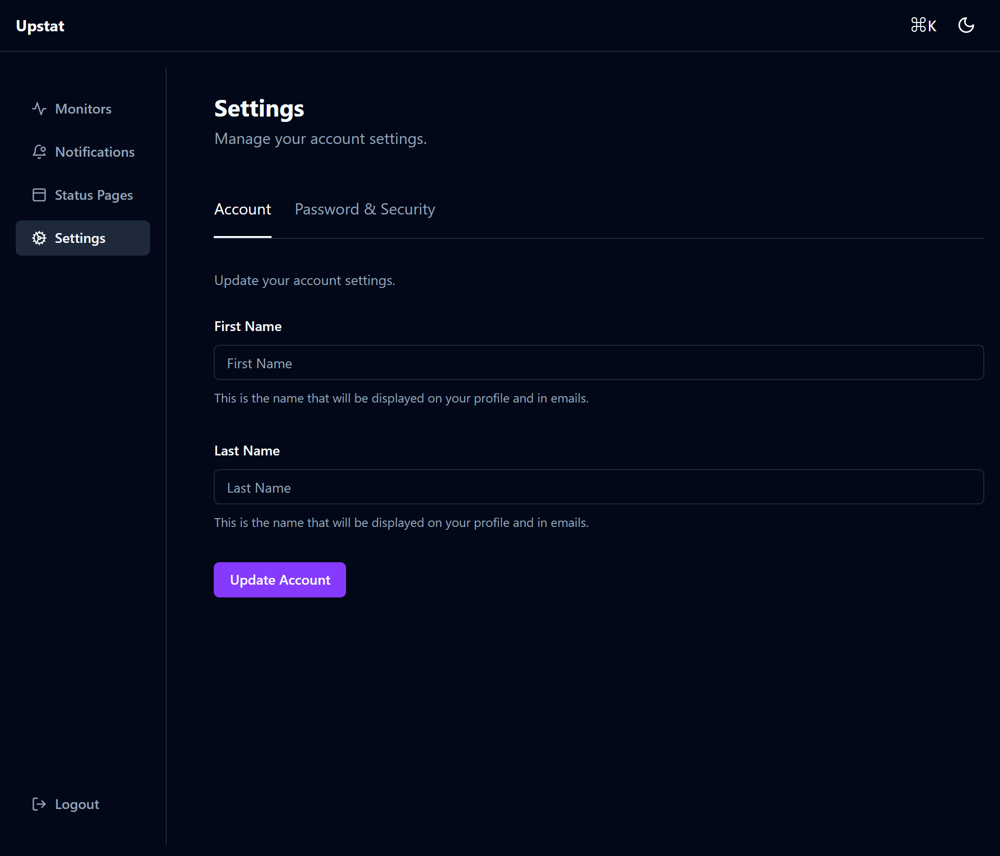
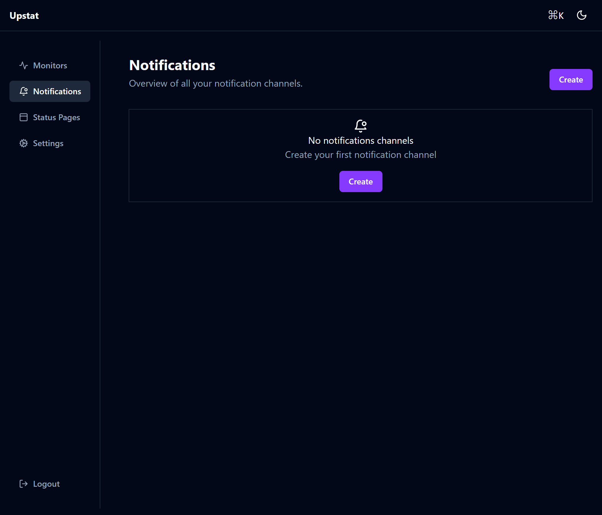

<div align="center" width="100%">
    
</div>

# Upstat
    
> simple and easy-to-use self-hosted status monitoring tool



## 💻 Live Demo

Try it.

Demo Server (Location: Singapore): [https://demo.upstat.com](https://upstat.chamanbudhathoki.com.np/)

Username: `demo`
Password: `demodemo`

## ⭐ Features

It needs more features but for now...

-   Monitoring uptime for HTTP(s)
-   Status and Latency Chart
-   Notifications via Discord
-   60-second intervals
-   Fancy, Reactive, Fast UI/UX
-   Multiple status pages
-   Map status pages to specific domains
-   Ping chart
-   Certificate info
-   PWA
-   Sqlite & Postgres database support

And dozens of smaller features to be added.

## 🔧 How to Install

### 🐳 Docker

For Sqlite

```bash
curl https://raw.githubusercontent.com/chamanbravo/upstat/main/docker-compose-sqlite.yml -o docker-compose.yml
docker compose up
```

For Postgres
```bash
curl -O https://raw.githubusercontent.com/chamanbravo/upstat/main/docker-compose.yml
docker compose up
```

Upstat is now running on http://localhost:3000

> [!IMPORTANT]
> Make sure to change the enviornment values before deploying.

### 💪🏻 Non-Docker

Requirements:

- Node.js 14 / 16 / 18 / 20.4
- npm 9
- Golang 1.21+
- Postgres (Optional)

```shell
cp .sample.env .env
```

```shell
air
cd web && npm run dev
```

## Tech stack

-   React
-   Shadcn
-   Golang
-   Postgres/Sqlite

## 🙌 Contributing

I welcome contributions! Contributions are what make the open source community such an amazing place to learn, inspire, and create. Any contributions you make are **greatly appreciated**.

If you have a suggestion that would make this better, please fork the repo, make changes and create a pull request. You can also simply open an issue with the tag "enhancement".
Don't forget to give the project a star! Thanks again!

1. Fork the Project
2. Create your Feature Branch (`git checkout -b feature/AmazingFeature`)
3. Commit your Changes (`git commit -m 'Add some AmazingFeature'`)
4. Push to the Branch (`git push origin feature/AmazingFeature`)
5. Open a Pull Request

## Contributors

<a href="https://github.com/chamanbravo/upstat/graphs/contributors">
  
</a>

## 📄 License

This project is licensed under the [MIT License](https://opensource.org/license/mit/).

## 🖼 More Screenshots

Create a Monitor



Monitor Page



Settings Page



Notifications




