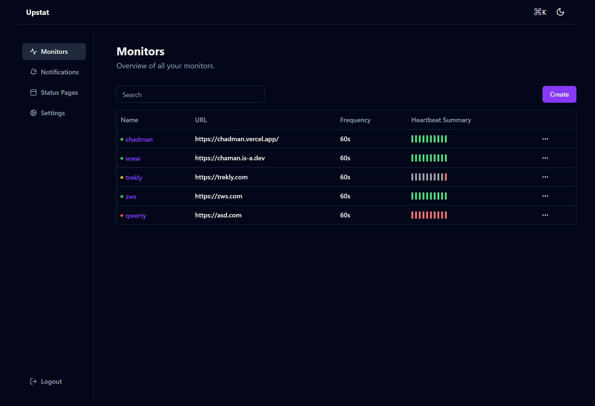

# Upstat
    
> simple and easy-to-use self-hosted status monitoring tool

## ⭐ Features

It needs more features but for now...

-   Monitoring uptime for HTTP(s)
-   Fancy, Reactive, Fast UI/UX
-   Status and Latency Chart

And dozens of smaller features to be added.

## 🔧 How to Install

### 🐳 Docker

```bash
docker compose up
```

Upstat is now running on http://localhost

### 💪🏻 Non-Docker

Requirements:

- Node.js 14 / 16 / 18 / 20.4
- npm 9
- Golang 1.21
- Postgres

```shell
cp .sample.env .env
```

```shell
air
cd web && npm run dev
```

## Tech stack

-   React
-   Shadcn
-   Golang
-   Postgres

## 🙌 Contributing

I welcome contributions! Contributions are what make the open source community such an amazing place to learn, inspire, and create. Any contributions you make are **greatly appreciated**.

If you have a suggestion that would make this better, please fork the repo, make changes and create a pull request. You can also simply open an issue with the tag "enhancement".
Don't forget to give the project a star! Thanks again!

1. Fork the Project
2. Create your Feature Branch (`git checkout -b feature/AmazingFeature`)
3. Commit your Changes (`git commit -m 'Add some AmazingFeature'`)
4. Push to the Branch (`git push origin feature/AmazingFeature`)
5. Open a Pull Request

## 📄 License

This project is licensed under the [MIT License](https://opensource.org/license/mit/).
